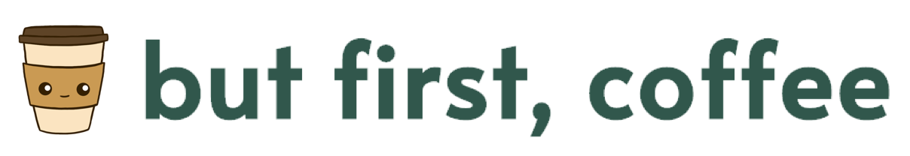
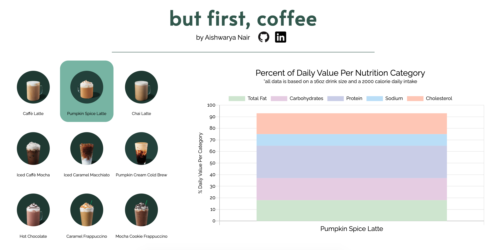

# But First, Coffee

    

But First, Coffee is a data visualization website that displays nutritional facts of popular Starbucks drinks. Users can click on any drink and hover over the graph to learn about its nutritional value breakdown.

Live site: [But First, Coffee](https://aishnair22.github.io/but-first-coffee/)

## Technologies Used
* Javascript
* Chart.js
* HTML5
* CSS

## Main Wireframe

## Functionality
* Introduction Modal to describe the website to users
* Users can choose from 9 drinks
* Users can hover over the graph to get the exact percentage data values
* Graph re-renders with new data for each drink

### Code for Graph Re-render
I added a click event listener to each of the drink images. Depending on the alt attribute of the image that was clicked, I reassigned the drink variable to the evaluated event.target.alt, which corresponded to the correct drink object that had been defined earlier in the file. I then reassigned the chart data and labels, and called the update method that is part of the Chart.js API.

<pre><code>
    document.addEventListener('click', (event) => {
        if (!event.target.matches('.click-me')) return; 

        drink = eval(event.target.alt)
        
        myChart.data.labels = drink.name;    
        myChart.data.datasets = [
            {
                label: 'Total Fat',
                data: drink.fat,
                backgroundColor: '#cde5ce',
            },
            {
                label: 'Carbohydrates',
                data: drink.carbs,
                backgroundColor: '#e6cbe3',
            },
            {
                label: 'Protein',
                data: drink.protein,
                backgroundColor: '#c9cce8',
            },
            {
                label: 'Sodium',
                data: drink.sodium,
                backgroundColor: '#b9def8',
            },
            {
                label: 'Cholesterol',
                data: drink.cholesterol,
                backgroundColor: '#ffc6b3',
            }
        ]
        myChart.update();
    }, false);
</code></pre>

### Intro Modal

### Main Page

### Website Tour

